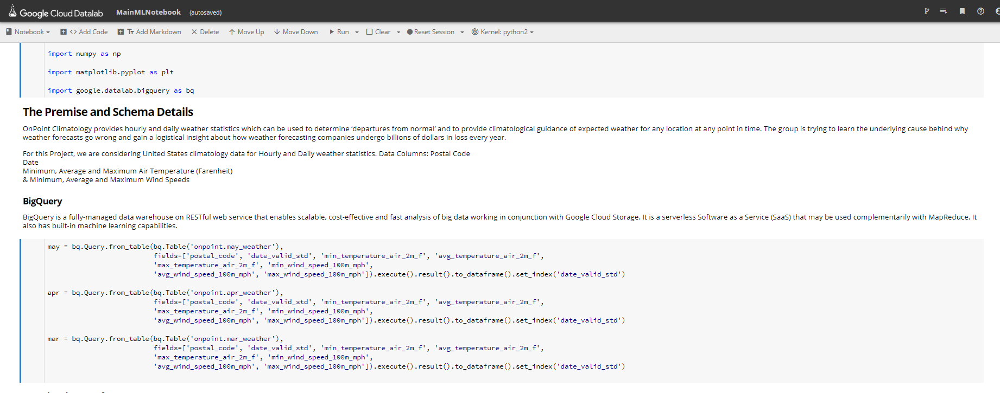
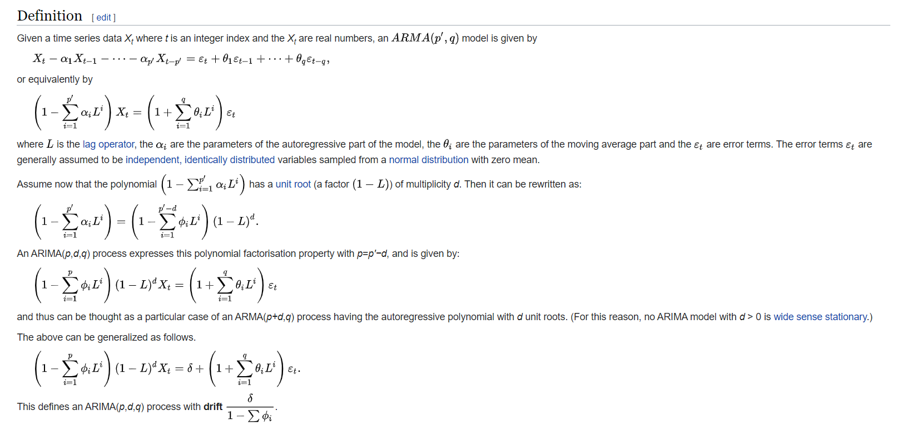
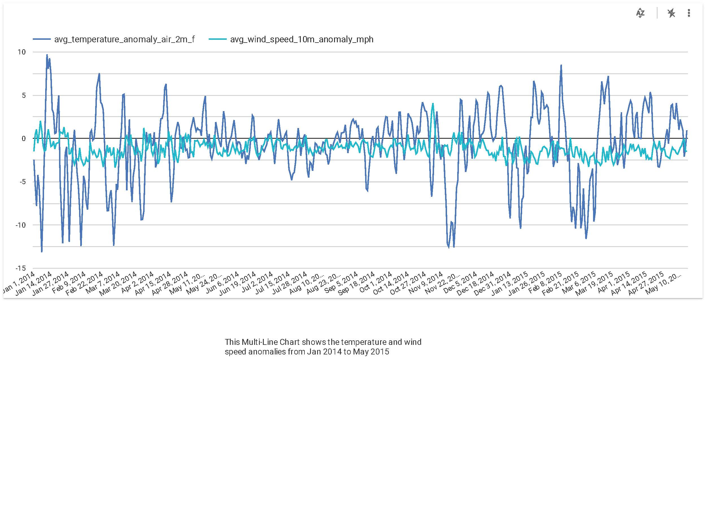
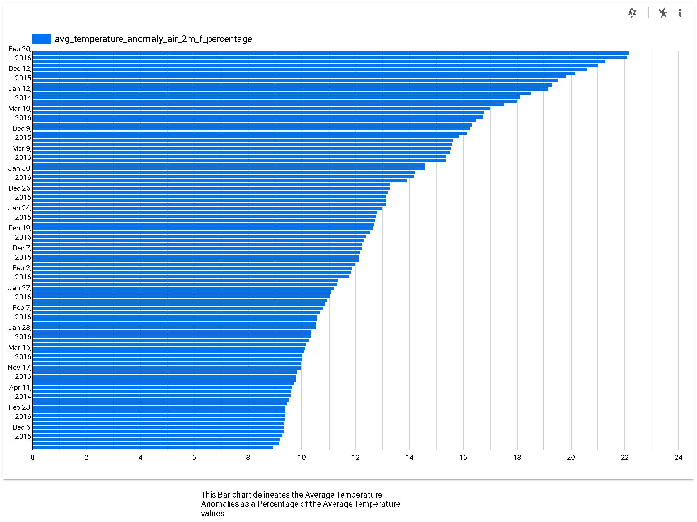
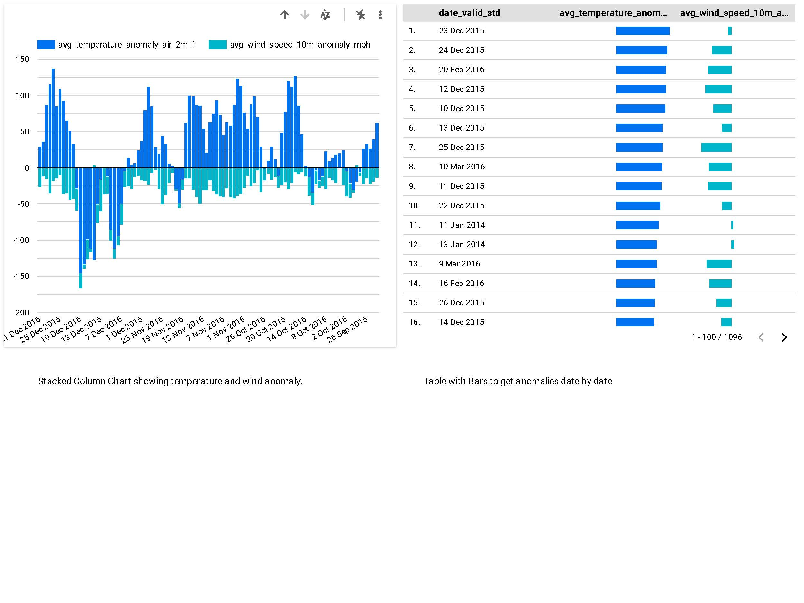

# OnPoint Weather Forecast - Machine Learning for Time Series Analysis of Weather Forecast Anomaly Data

## ABOUT THE DATASET

OnPoint Weather is a global weather dataset for business available for any latitutde/longitude point and geographic area such as ZIP codes. OnPoint Weather provides a continuum of hourly and daily weather from the year 2000 to current time and a forward forecast of 45 days.
Weather has a significant impact on businesses and accounts for hundreds of billions in lost revenue annually. OnPoint Weather allows businesses to quantify weather impacts and develop strategies to optimize for weather to improve business performance.
The Dataset can be found at https://console.cloud.google.com/marketplace/details/weathersource-com/weather-forecast

## MOTIVE

OnPoint Climatology provides hourly and daily weather statistics which can be used to determine ‘departures from normal’ and to provide climatological guidance of expected weather for any location at any point in time. The group is trying to learn the underlying cause behind why weather forecasts go wrong and gain a logistical insight about how weather forecasting companies undergo billions of dollars in loss every year.

## TARGET AUDIENCE

Although this project will be primarily focused on analysis/research on the data, it will try to shed some light on the margin of error in weather forecast and the suggested correction measures. We will use statistics within the dataset to determine the causality in weather forecast errors. In other words, anyone with an interest in weather forecasts will serve as our target audience.

## DOMAIN: Analysis/Forecasting/Optimization

## Analysis Tool: BigQuery
BigQuery is a fully-managed data warehouse on RESTful web service that enables scalable, cost-effective and fast analysis of big data working in conjunction with Google Cloud Storage. It is a serverless Software as a Service (SaaS) that may be used complementarily with MapReduce. It also has built-in machine learning capabilities.
More details about BigQuery can be found at https://cloud.google.com/bigquery

## Datalab equipped with the BigQuery API

Cloud Datalab is a powerful interactive tool created to explore, analyze, transform, and visualize data and build machine learning models on Google Cloud Platform. It runs on Compute Engine and connects to multiple cloud services easily so you can focus on your data science tasks. We use this feature with the BigQuery API for a seamless execution of our machine learning project

## DATA PREPROCESSING

We are using Weather Source's OnPoint Climatology Data, which is essentially the statistics of weather over time. Climatology data can be useful in two ways - It allows users to compare weather to what should be ‘normal’ weather for a place and time. This allows for finding 'Anomalies' in the weather, that is, whether parameters like Temperature, Humidity, Air Pressure etc are 'Departing from Normal' . Often it’s the departure from normal that has the biggest influence on consumers and the greater the departure from normal the greater it's effect on customers and consequently, the Business.
For this Project, we are considering United States climatology data for Hourly and Daily weather statistics.
Data Columns:

Postal Code  
Country Code  
Valid date/time (UTC)  
Day of Year (UTC)  
Hour of the day (UTC)  
Valid date/time (Local Time)  
Daylight Saving Time Offset (Minutes)  
Air Temperature (F)  
Wet Bulb Temperature (F)  
Dew Point Temperature (F)  
Feels Like Temperature (F)  
Wind Chill Temperature (F)  
Heat Index Temperature (F)  
Relative Humidity (percent)  
Specific Humidity (grams/kilogram)  
Surface Pressure (millibars)  
Pressure Tendency (millibars)  
Mean Sea Level Pressure (millibars)  
Wind Speed at 10 meter height (mph)  
Wind Direction at 10 meter height (degrees)  
Wind Speed at 80 meter height (mph)  
Wind Direction at 80 meter height (degrees)  
Wind Speed at 100 meter height (mph)  
Wind Direction at 100 meter height (degrees)  
Total Precipitation Amount (in)  
Total Snowfall Amount (in)  
Cloud Cover (percent)  
Solar Radiation (watts/m^2)  

For this project we are using data from the year 2016 which is available on GCP.
For this task we have implemented some sample queries to illustrate the depth of the dataset. You can view the results for a New York weather forecast in the ./results-20200407-131226.csv file

## TENTATIVE PLAN OF ACTION

As we can see in our analysis that the average anomalies in temperature changes are quite significant. Using this metric, we should be able to estimate the rate of error in our actual weather predictions. We can optimize our predictions using these columns by using some optimization techniques. We are currently planning on using ARIMA (Auto Regressive Integrated Moving Average) based on our time series data to correct our predictions.

After this, we will ingest this data into GCP for querying and EDA. We then use ARIMA to predict values for average air temperature on our end. An alternative to ARIMA would be using Google Cloud Datalab with Tensorflow to train, predict and analyze our time series data.

## RESEARCH QUESTION
What patterns can we observe in weather forecast errors which we can analyze and debug? Optimizing these predictions by avoiding such errors in data can possibly save weather forecast companies billions of dollars in revenue.

## ARIMA

ARIMA stands for Autoregressive Integrated Moving Average. In statistics and econometrics, and in particular in time series analysis, an autoregressive integrated moving average (ARIMA) model is a generalization of an autoregressive moving average (ARMA) model. Both of these models are fitted to time series data either to better understand the data or to predict future points in the series (forecasting). ARIMA models are applied in some cases where data show evidence of non-stationarity, where an initial differencing step (corresponding to the "integrated" part of the model) can be applied one or more times to eliminate the non-stationarity.

Here is a mathematical definition of ARIMA from Wikipedia

The AR part of ARIMA indicates that the evolving variable of interest is regressed on its own lagged (i.e., prior) values. The MA part indicates that the regression error is actually a linear combination of error terms whose values occurred contemporaneously and at various times in the past. The I (for "integrated") indicates that the data values have been replaced with the difference between their values and the previous values (and this differencing process may have been performed more than once). The purpose of each of these features is to make the model fit the data as well as possible.

Non-seasonal ARIMA models are generally denoted ARIMA(p,d,q) where parameters p, d, and q are non-negative integers, p is the order (number of time lags) of the autoregressive model, d is the degree of differencing (the number of times the data have had past values subtracted), and q is the order of the moving-average model. Seasonal ARIMA models are usually denoted ARIMA(p,d,q)(P,D,Q)m, where m refers to the number of periods in each season, and the uppercase P,D,Q refer to the autoregressive, differencing, and moving average terms for the seasonal part of the ARIMA model.[4][5]

## REPORT

The report will be generated by ingesting the data into Google Cloud and we will be using Google Data Studio for EDA. Two interactive dashboards will be delivered along with a brief writeup of our process.

## Dashboards
The key takeaway from this plot is that all indices are affected globally. Sudden changes in temperature affects all of these regions at the same time which also signifies that these indices are correlated. Although, the funny thing about weather forecasts is that yesterdays weather may or may not affect todays weather. This is an important fact to be noted when dealing with Time Series.

## CONTRIBUTORS / GROUP MEMBERS

|Name              |Responsibilities                                                              |
|:----------------:|:----------------------------------------------------------------------------:|
|Sourabh Pardeshi  |Brainstorm approaches, Querying, EDA, Plot charts and graphs, ARIMA           |
|Mihir Vadeyar     |Brainstorm approaches, Querying, EDA, Plot charts and graphs, ARIMA           |
|Swapnil Bokil     |Plotting, Querying, Preprocessing, EDA, Report and Presentation, ARIMA        |
|Sahil Deshmukh    |Plotting, Preprocessing, EDA, Report and Presentation, ARIMA                  |
|Shubham Gandhi    |Plotting, Preprocessing, EDA, Report and Presentation, ARIMA                  |

## EVALUATING MACHINE LEARNING RULES PERTAINING TO THE PROJECT

### Don’t overthink which objective you choose to directly optimize:  

In a time series analysis especially for weather forecasts, there are a large number of factors that affect the weather prediction and although there are a lot of tested foundational Machine Learning models that we can use to optimize our predictions, it is almost impossible to predict what causes the predictions to go wrong. We can see this task as a Black Box in which we don’t know what factors could lead to the forecast going wrong. But since we have the data in a variety of columns, applying the simplest of metrics to any of the feature columns could give us significant results.

### The ML objective should be easy to measure and is a proxy for the "true" objective:  
The training should be on a simple objective over which we can add a policy layer based on a rather simple logic, for example, even though our final objective is to detect why forecasts would go wrong, instead of focusing on it too much perhaps we could think about why they go right and what causes them to go right. We can maybe reverse engineer our way towards finding out why our predictions have lower precision.

### Look for patterns in the measured errors and create new features:  

This one is a bit general in terms of any Machine Learning model but in our case, we can deduce patterns from our false predictions. For example, if most of our predictions are false for the month of May, April and January, we can create a new feature column called season which would notify us that rains could be the case even in summer or spring and what percentage of days in summer are falsely predicted to be sunny.

## REFERENCES
[1] Understanding, modeling and predicting weather and climate extremes: Challenges and opportunities
JanaSillmann Thordis Thorarinsdottir Noel Keenlyside Nathalie Schaller Lisa V. Alexander Gabriel Hegerl Sonia I.Seneviratne Robert Vautard Xuebin Zhang Francis W.Zwiersi
https://www.sciencedirect.com/science/article/pii/S2212094717300440

[2] Predicting uncertainty in forecasts of weather and climate
T N Palmer
https://iopscience.iop.org/article/10.1088/0034-4885/63/2/201

[3] On the reliability of seasonal climate forecasts
A. Weisheimer 1,2 and T. N. Palmer 1

[4] Time Series Forecasting System. SAS Institute. Retrieved 19 May 2015.

[5] Hyndman, Rob J; Athanasopoulos, George. 8.9 Seasonal ARIMA models. Forecasting: principles and practice. oTexts. Retrieved 19 May 2015.
